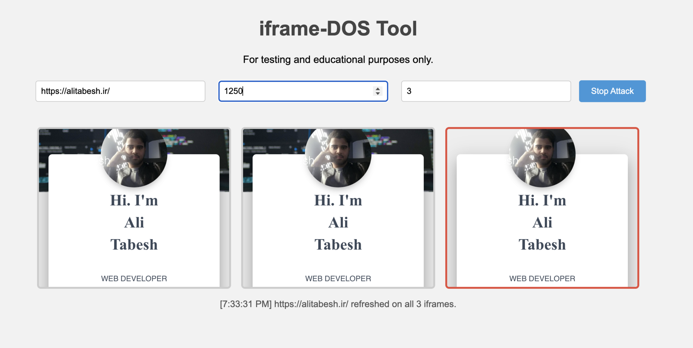

# iframe-DOS

A browser-based tool to simulate a Denial-of-Service (DoS) attack by repeatedly refreshing a target URL inside one or more iframes.

> ⚠️ **Disclaimer:** This tool is for **educational and testing purposes only**. Do **not** use it on systems you do not own or have explicit permission to test. Unauthorized use may violate cybercrime laws.

---

## 🧠 Features

- ✅ **Start/Stop Attack Toggle** – Easily control the attack cycle.
- 🕒 **Enforced Minimum Refresh Interval (50ms)** – Prevents browser crashes and excessive abuse.
- 🧩 **Multiple Iframe Support** – Load the target URL in multiple frames simultaneously (1–10).
- 🔁 **Visual Feedback**
  - Countdown until each iframe’s next refresh.
  - Active iframe highlighted visually.
  - Timestamped logs of each refresh cycle.

---

## ⚙️ Requirements

- Modern web browser (Chrome, Firefox, Edge, Safari)
- JavaScript enabled
- No server required (pure HTML/JS)

---

## 🔒 Security

- Iframes use sandboxing (`sandbox` attribute) for safety.
- This tool does **not** bypass CORS or X-Frame-Options. If a site blocks embedding, the iframe may not load.
- For legal, educational, and authorized testing only.

---

## 📦 How to Use

1. **Clone this repo** or download the HTML file:

   ```bash
   git clone https://github.com/alty-ir/iframe-dos.git
   cd iframe-dos
   ```

2. **Open `index.html`** in a modern web browser.

3. **Configure the tool:**
   - Enter a valid **target URL** (e.g., `http://example.com`)
   - Set the **refresh interval** (minimum 50ms, recommended 125ms)
   - Set the **number of iframes** (1–10 for best performance)

4. Click **Start Attack** to begin refreshing.

5. Click **Stop Attack** to halt the operation.

---

## 🖼️ Screenshot



---

## 📁 Project Structure

```bash
iframe-dos/
├── index.html
├── README.md
└── screenshot.png
```

---

## ⚠️ Legal Notice

This tool by [Ali Tabesh (GitHub: @alty-ir)](https://github.com/alty-ir) is designed **only for legal testing, research, and educational demonstrations**.

Do not use this software on systems you do not own or have explicit authorization to test. Unauthorized use is a criminal offense in many jurisdictions.

---

## 🤝 Contributing

Pull requests and suggestions are welcome! For major changes, please open an issue first to discuss what you would like to change.

---

## 📄 License

This project is licensed under the [MIT License](LICENSE).

---

## 👥 Authors

- **Ali Tabesh** — [@alty-ir](https://github.com/alty-ir)
- **Zahra YNP** — [@zahra-ynp](https://github.com/zahra-ynp)